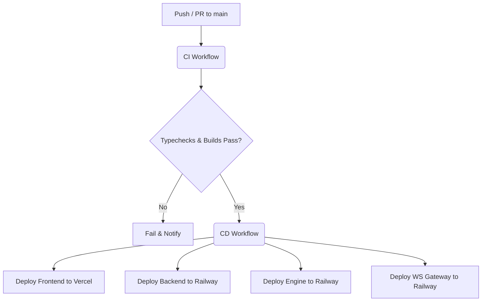

# CEX CI/CD Pipeline Documentation

This document describes the Continuous Integration (CI) and Continuous Deployment (CD) workflows implemented via GitHub Actions for the Centralized Exchange (CEX) project.

---

## Workflow Overview

The CEX codebase uses two distinct workflows located in `.github/workflows/`:
1. **CI Workflow (`ci.yml`)**: Validates code compilation, type safety, and Docker image builds.
2. **CD Workflow (`deploy.yml`)**: Deploys services to production (Vercel & Railway) automatically after successful CI builds.

---

## 1. Continuous Integration (CI)

*   **Trigger**: Triggered on every `push` and `pull_request` targeting the `main` branch.
*   **Tasks Checked**:
    *   **Typecheck & Build**: A matrix job that typechecks all services (`Frontend`, `backend`, `engine`, `Ws`) using typescript compiling validations (`tsc --noEmit`).
        *   Uses caching for `npm` (Frontend) and `bun` (backend, engine, Ws) packages to optimize runtime.
        *   Automatically generates Prisma client files for the backend build context.
    *   **Docker Build Validation**: A matrix job that compiles the Docker images for all services using local Dockerfiles to ensure no containerization errors exist.

---

## 2. Continuous Deployment (CD)

*   **Trigger**: Triggered on completion of the `CI` workflow on the `main` branch, executing **only** if the CI run completes with a `success` status.
*   **Platforms**:
    *   **Frontend**: Deployed as a static React SPA on [Vercel](https://vercel.com).
    *   **backend, engine, Ws**: Deployed as containers/services on [Railway](https://railway.app).
*   **Deployment Commands**:
    *   Uses Vercel CLI (`vercel deploy`) for static SPA prebuilts.
    *   Uses Railway CLI (`railway deploy --service <name>`) to deploy each backend/worker service inside their respective folders.

---

## 3. Required GitHub Secrets

To authenticate deployments with Vercel and Railway, configure the following secrets in your repository settings under **Settings > Secrets and variables > Actions**:

| Secret Name | Description | Source / Location |
| :--- | :--- | :--- |
| `VERCEL_TOKEN` | Access token to authenticate Vercel CLI. | Vercel Account Settings > Tokens |
| `VERCEL_ORG_ID` | Vercel team/organization ID. | Found in `.vercel/project.json` or Organization Settings |
| `VERCEL_PROJECT_ID` | Vercel project ID associated with CEX frontend. | Found in `.vercel/project.json` or Project Settings |
| `RAILWAY_TOKEN` | Personal token to authenticate Railway CLI. | Railway Account Settings > Tokens |
| `RAILWAY_PROJECT_ID` | Railway project ID hosting CEX services. | Railway Project Settings > ID |

---

## 4. Manual Triggers

Both workflows are set up to support automatic orchestration. To trigger a manual deployment:
1. Navigate to the **Actions** tab in your GitHub repository.
2. Select the **CI** workflow from the left sidebar.
3. Click the **Run workflow** dropdown and select the branch you wish to build.
4. Once the CI workflow successfully completes, the CD workflow will trigger automatically and carry out the deployments.
